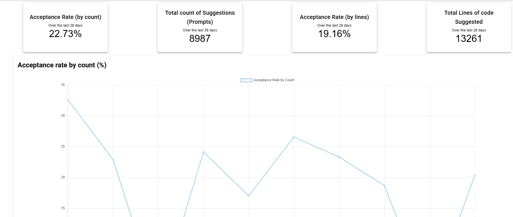
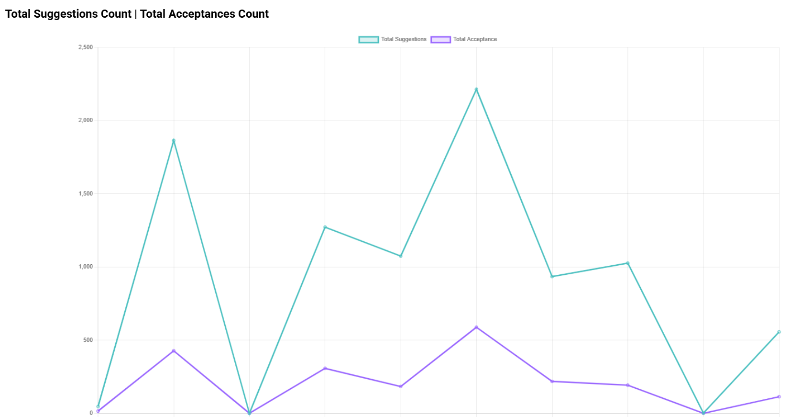

# GtiHub Copilot の利用状況の確認

## GitHub Copilot Metrics Viewer

GitHub Copilotの利用状況を確認するためのツールです。

このツールを使用することで、GitHub Copilotの利用状況を可視化し、分析することができます。
これにより、チームや個人の生産性向上に役立てることができます。

GitHub OrganizationまたはEnterprise Accountの GitHub Copilot に関連する様々なメトリクスをグラフ形式で表示します。これらの可視化は、データを明確に表現するように設計されており、GitHub Copilot の影響と導入状況を容易に理解・分析できます。このアプリケーションは、[GitHub Copilot Metrics API](https://docs.github.com/en/enterprise-cloud@latest/rest/copilot/copilot-metrics?apiVersion=2022-11-28)を利用しています。

> [!NOTE]
>   これは、GitHub Copilot の利用状況を可視化するためのツールであり、GitHub Copilot の機能そのものではありません。
>   また、こちらのリポジトリをフォークして利用しています。
>   [copilot-metrics-viewer](https://github.com/github-copilot-resources/copilot-metrics-viewer)

## 機能

- Copilotの利用状況のグラフ表示
- 利用時間の集計
- 利用頻度の分析
- チームメンバーごとの利用状況の比較
    - チームメンバーごとの利用時間の比較
    - チームメンバーごとの利用頻度の比較
- 利用状況のエクスポート機能
  - CSV形式でのエクスポート
  - JSON形式でのエクスポート

## .env ファイルの設定

GitHub Copilot Metrics Viewerを使用するには、`.env`ファイルを設定する必要があります。
以下の環境変数を設定してください。
```env
NUXT_GITHUB_TOKEN=<Copilot_のアクセスTOKEN>
```
アクセストークンは、GitHubの[Personal access tokens](https://docs.github.com/en/authentication/keeping-your-account-and-data-secure/creating-a-personal-access-token)を参照して作成してください。
このトークンは、GitHub Copilot Metrics APIにアクセスするために必要です。

## ローカルサーバ構築

```bash
# 必要なパッケージのインストール
npm install
# ローカルサーバの起動
npm run dev
```

ローカルサーバが起動したら、ブラウザで以下のURLにアクセスしてください。
```bash
http://localhost:3000
```

[http://localhost:3000](http://localhost:3000) でアプリケーションにアクセスできます。


## メトリクスの見方

メトリクスの詳細は[GitHub APIレスポンススキーマ](https://docs.github.com/en/rest/copilot/copilot-metrics?apiVersion=2022-11-28#get-copilot-metrics-for-an-organization)で詳しく説明されています。

### Acceptance Rate（承認率）

GitHub Copilot によって提案された行と提案の合計数に対する、承認された行と提案の比率



提案総数

### Total Suggestions Count | Total Acceptances Count


- Total Suggestions Count : 提案されたコード行数
  - GitHub Copilot が提案したコード行数の合計を表示します。これにより、コード生成と提供された支援の量を把握できます。
- Total Acceptances Count : 承認された合計行数
  - ユーザーが承認したコードの合計行数 (完全な承認) であり、提案されたコードのうち実際にどれだけが利用され、コードベースに組み込まれているかについての洞察を提供します。



### Total Active Users

- Total Active Users : アクティブユーザー数
  - GitHub Copilot を使用しているアクティブなユーザーの数を示します。これにより、チームや組織内での Copilot の利用状況を把握できます。

### 言語別内訳分析

- Language Breakdown : 言語別の利用状況
  - GitHub Copilot が提案したコード行数を言語ごとに分類し、どのプログラミング言語で最も多くの提案が行われているかを示します。これにより、特定の言語における Copilot の効果を分析できます。

言語内訳分析タブには、過去28日間における各言語の承認済みプロンプト、承認済みコード行数、承認率（%）を示す表も表示されます。エントリは、承認済みコード行数の降順で並べ替えられています。

### Copilot Chat Metrics

Copilot Chat Metrics タブでは、GitHub Copilot Chat の利用状況を分析できます。以下のメトリクスが表示されます。

### Total Acceptances | Total Turns Count

- Total Acceptances : 承認されたチャットの合計数
  - ユーザーが Copilot Chat で受け取った提案のうち、実際に承認されたものの数を示します。これにより、チャット機能の有効性を評価できます。
- Total Turns Count : チャットの合計ターン数
  - ユーザーと Copilot Chat の間で行われた全てのやり取りの数を示します。これにより、チャットの活発度や利用頻度を把握できます。
  - 「ターン」には、ユーザーによる入力とCopilotからの応答の両方が含まれます。

### Total Active Copilot Chat Users

- Total Active Copilot Chat Users : アクティブな Copilot チャット ユーザーの合計
  - Copilot Chat を使用しているアクティブなユーザーの数を示します。これにより、チャット機能の利用状況を把握できます。

### All assigned seats

- All assigned seats : 割り当てられたすべてのシート
  - GitHub Copilot のライセンスが割り当てられているユーザーの数を示します。これにより、チームや組織内での Copilot の導入状況を把握できます。
